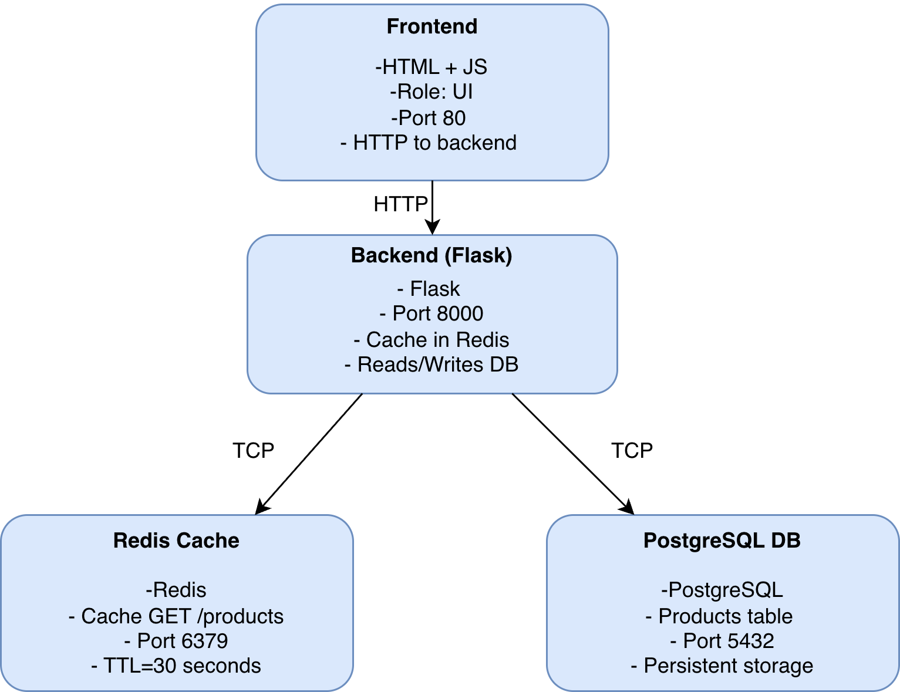

# docker Завдання 6

## Побудувати UML-діаграму компонентів або C4-Container Diagram для створеної системи.

Підписати кожен контейнер (назва, роль, порти, технології).

Позначити стрілками зв’язки (HTTP, TCP, DB-запити).

### Результат

